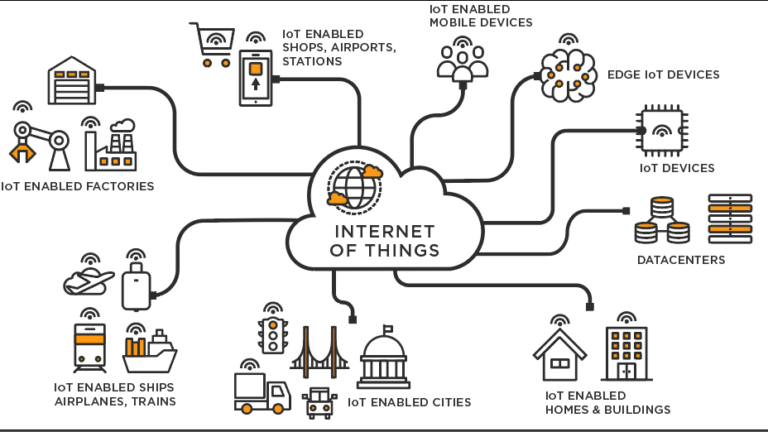
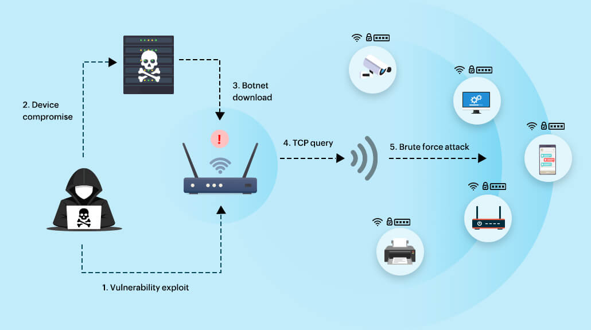
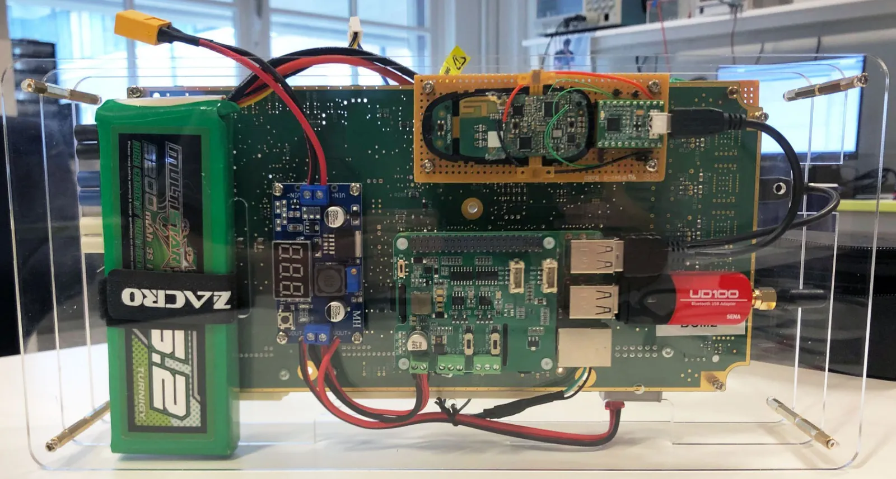

# NESNELERIN INTERNETI (INTERNET OF THINGS)

Fiziksel nesnelerin internet üzerinden birbirleriyle iletişim kurabildiği, veri paylaşabildiği bir teknolojidir. Sensörler ve internet bağlantısıyla donatılan nesneler, daha verimli, akıllı ve bağlantılı sistemler oluşturarak günlük yaşamı kolaylaştırır. Örnekler arasında uzaktan kontrol edilebilen termostatlar, akıllı şehir trafik yönetimi ve endüstriyel süreç izleme bulunmaktadır.

# IOT GÜVENLIĞI NEDIR? 

Nesnelerin İnterneti için güvenlik, internet cihazlarını ve bağlandıkları ağları çevrimiçi tehditlere ve ihlallere karşı korumak anlamına gelir. Bu, cihazlar arasında potansiyel güvenlik açıklarını belirleyerek, izleyerek ve ele alarak elde edilir. En basit hâliyle IoT güvenliği, IoT sistemlerini güvende tutan uygulamadır.

# GENEL TEHDITLER
## VERI GIZLILIĞI VE İZINSIZ ERIŞIM
İoT cihazları genellikle hassas verileri toplar ve işler. Saldırganlar, bu verilere erişmek veya bu verileri ele geçirmek amacıyla güvenlik açıklarını kullanabilirler. Örneğin, bir ev otomasyon sistemi üzerinden saldırganlar ev sahibinin günlük rutinlerini izleyebilir veya sağlık izleme cihazları aracılığıyla kişisel sağlık verilerine erişebilir.

## CIHAZIN ELE GEÇIRILMESI
İoT cihazları genellikle sınırlı işlem gücüne ve belleğe sahip olabilir. Bu, cihazların güçlü güvenlik önlemlerini uygulamakta zorluk yaşamasına neden olabilir. Saldırganlar, güvenlik açıklarını kullanarak cihazları ele geçirebilir ve istedikleri gibi kontrol edebilir. Ele geçirilen cihazlar daha sonra ağ içindeki diğer cihazlara veya sunuculara yönelik saldırılarda kullanılabilir.

## AĞ SALDIRILARI VE SERVIS KESINTILERI

İoT cihazları genellikle bir ağ üzerinden iletişim kurar. Saldırganlar, bu iletişimi bozmak veya kesmek amacıyla çeşitli ağ saldırıları düzenleyebilirler. Örneğin, DDoS saldırıları ile ağa aşırı yük bindirerek hizmet kesintilerine neden olabilirler. Bu durum, cihazların normal çalışmasını engelleyerek, cihazın işlevselliğini veya bağlı olduğu ağın hizmet kalitesini olumsuz etkileyebilir ya da PDOS saldirisi ile kalici olarak hizmeti sonlandirabilir.

# GENEL IOT AÇIKLARI VE SEBEPLERI

## TEST VE GELIŞTIRME EKSIKLIĞI
Bazı IoT üreticileri, ürünleri piyasaya sürmek için acele ederken güvenliği sonradan düşünülebilir olarak görürler. Cihazla ilgili güvenlik riskleri, geliştirme sürecinde gözden kaçmış olabilir ve başlatıldıktan sonra güvenlik güncellemeleri eksik olabilir. Bununla birlikte, IoT güvenliği konusundaki farkındalık arttıkça cihaz güvenliği de artmaktadır.

## KABA KUVVETE NEDEN OLAN VARSAYILAN PAROLALAR
Birçok IoT cihazı varsayılan parolalarla gelir ve bunlar genellikle zayıftır. Bunları satın alan müşteriler, değiştirebileceklerini (ve değiştirmeleri gerektiğini) fark etmeyebilirler. Zayıf parolalar ve oturum açma bilgileri, IoT cihazlarını parola korsanlığına ve kaba kuvvete karşı savunmasız bırakır.

## IOT KÖTÜ AMAÇLI YAZILIM VE FIDYE YAZILIMI
Son yıllarda IoT bağlantılı cihazlarda önemli artış göz önüne alındığında (ve bunun devam etmesi bekleniyor) kötü amaçlı yazılım ve fidye yazılımlarının bunlardan yararlanma riski arttı. IoT botnet kötü amaçlı yazılımları en sık görülen çeşitler arasında yer alıyor.

## VERI GIZLILIK SORUNLARI
IoT cihazları, çok çeşitli kullanıcı verilerini toplar, iletir, depolar ve işler. Çoğu zaman, bu veriler üçüncü taraflarla paylaşılabilir veya satılabilir. Kullanıcılar genellikle IoT cihazlarını kullanmadan önce hizmet şartlarını kabul etse de, birçok kişi şartları okumaz; bu da kullanıcıların verilerinin nasıl kullanılabileceğini her zaman anlamadıkları anlamına gelir.

## ARTAN SIBER SALDIRILAR
Virüslü IoT cihazları, DDoS saldırıları için kullanılabilir. Bu, ele geçirilen cihazların daha fazla makineye bulaşmak veya kötü niyetli faaliyetleri gizlemek için bir saldırı üssü olarak kullanıldığı yerdir. IoT cihazlarına yönelik DDoS saldırıları daha yaygın olarak kuruluşları etkilerken, akıllı evleri de hedefleyebilir.

## GÜVENSIZ ARABIRIMLER
IoT cihazlarını etkileyen yaygın arabirim sorunları arasında zayıf şifreleme veya şifreleme olmaması ya da yetersiz veri kimlik doğrulaması yer alır.

## UZAKTAN ÇALIŞMANIN ARTMASI
Covid-19 pandemisinin ardından tüm dünyada uzaktan çalışma oranı arttı. IoT cihazları, birçok kullanıcının evden çalışmasına yardımcı olmuş olsa da, genellikle ev ağları, kurumsal ağlarla aynı güvenliğe sahip olmayabilir. Artan kullanım, IoT güvenlik açıklarını ön plana çıkardı.

## KARMAŞIK ORTAMLAR
Araştırmalar, 2020’de ABD’deki ortalama bir ev halkının 10 bağlantılı cihaza erişimi olduğunu gösteriyor. Tüm ev ağını riske atmak için tek bir cihazda gözden kaçan bir yanlış güvenlik yapılandırması yeterlidir.

# Bazı Ünlü IoT Saldırıları

## Mirai botnet saldırısı

Bugün en yaygın IoT saldırısı, 2016’da ortaya çıkan Mirai kötü amaçlı yazılımdır. Kötü amaçlı yazılım , IoT cihazları için halka açık interneti tarar ve genel fabrika varsayılan kullanıcı adları ve şifreleri listesini kullanarak uzak bir telnet bağlantısı kurmaya çalışır. Bir cihaza virüs bulaştığı anda, kötü amaçlı yazılım daha fazla kurban aramaya başlar. Tüm cihazlar, daha sonra saldırganın komuta ve kontrol merkezi aracılığıyla yönlendirilen Mirai botnet’in bir parçası haline gelir. Saldırganlar daha sonra, kurbanların sunucularını çökertmek için müşterileri adına bir hedef hedefe bir DDoS saldırısı gerçekleştirir.

## VPNFilter kötü amaçlı yazılımı

VPNFilter, IoT cihazlarını hedef alan bir kötü amaçlı yazılım türüydü. Modemler ve yönlendiriciler gibi cihazları ele geçirerek, saldırganlara ağ trafiğini izleme ve yönlendirme yeteneği sağladı.

## Tesla Model X saldırıya uğradı
Bir siber güvenlik uzmanı, bir Bluetooth güvenlik açığından yararlanarak iki dakikadan kısa bir sürede Tesla Model X’i ele geçirdi. Kablosuz anahtarlarla açılan ve çalıştırılan diğer araçlar da benzer saldırılara maruz kaldı.

## Verkada camera feeds hacked

Verkada, bir güvenlik kamerası şirketidir. 2021’de İsviçreli bilgisayar korsanları, canlı kamera yayınlarının 150.000’inin güvenliğini ihlal etti. Bunlar, okullar, hastaneler, hapishaneler gibi kamu sektörü binalarındaki ve özel kurumsal kuruluşlardaki faaliyetleri izleyen kameralardı.
## Stuxnet Saldırısı

Stuxnet bilgisayar solucanı ilk olarak 2010’da ortaya çıktı. Kötü amaçlı yazılım ilk olarak zero-day açıklarından veya eski işletim sistemi sürümlerinden yararlanan Microsoft Windows makinelerine enjekte etti; başlangıçta USB flash sürücülere yayıldı. Windows makinesinde, Siemens programlanabilir mantık denetleyicisini (PLC) kontrol eden Siemens Step7 yazılımını arar. Step7 yazılımı ile kendini IoT cihazına kurar ve kontrolü ele alır. Stuxnet bir zamanlar İran tesislerini hedef aldı ve bildirildiğine göre İran’ın atom programına ciddi şekilde zarar verdi.  

## Flint / Brickerbot 

Brickerbot 2017’de keşfedilirken ve Silex 2019’da ortaya çıksa da ortak bir saldırı düzenine sahipler. Mirai gibi, yazılım da genel interneti tarar ve varsayılan ve zayıf oturum açma ve parola kombinasyonlarıyla IoT cihazında oturum açmaya çalışır. Enfeksiyondan sonra, yazılım tüm verilerin üzerine yazar ve ağ yapılandırmasını siler, bu da birileri cihaza fiziksel olarak el vermedikçe IoT cihazını kullanılamaz hale getirir. Flint ile Brickerbot farki ise biri Cihazların yazılımına zarar vererek işlevselliği etkisiz hale getirir digeri ise Cihazları "tuğla" haline getirerek, yani kalıcı olarak devre dışı bırakarak etki eder.

# IoT Saldırılarına Karşı Önlemler

## - Cihaz ve yazılım güncellemelerinden haberdar olun
Bir IoT cihaz satın alırken, satıcının güncelleme sağladığından emin olun ve güncellemeleri kullanıma sunulur sunulmaz uygulayın. Yazılım güncellemeleri, IoT cihaz güvenliğinde önemli bir etkendir.

## - IoT cihazlarında varsayılan parolaları değiştirin
Birçok kişi kullandığı her cihaz için aynı oturum açma adını ve parolayı kullanmaktadır. Bunların hatırlanması daha kolay olabilir ancak siber suçlular tarafından ele geçirilmesi de daha kolaydır. Her oturum açma işleminin benzersiz olduğundan emin olun ve yeni cihazlarda her zaman varsayılan parolayı değiştirin.

## - Tüm cihazlar ve Wi-Fi ağınız için güçlü parolalar kullanın
Sebebi oldukca belli. Bu yazımızı okuyarak daha da riskin daha da farkina varabilirsiniz.
Jonh the Reaper
[Jonh the Reaper](https://book.siberyavuzlar.com/araclar/john-the-ripper)
## - Yönlendiricinizin adını değiştirin
Üretici tarafından verilen yönlendirici adını değiştirmezseniz meraklı kimseler marka veya modeli tanımlayabilir. 
## - Bir misafir ağı kurun
Yönlendiriciniz size böyle bir seçenek veriyorsa WPA2 veya sonraki sürümü kullanarak bir misafir kablosuz ağı oluşturun ve bunu güçlü bir parolayla koruyun. Ziyaretçiler için bu misafir ağını kullanın: Arkadaşlarınız ve aileniz, ağınızı kullanmadan önce güvenliği ihlal edilmiş veya kötü amaçlı yazılım bulaşmış cihazları kullanıyor olabilir. Misafir ağı, genel ev ağı güvenliğini artırmaya yardımcı olur.
## - Cihazların mevcut özelliklerini takip edin ve kullanılmayan özellikleri devre dışı bırakın
Cihazlarınızdaki mevcut özellikleri kontrol edin ve olası saldırı fırsatlarını azaltmak için kullanmadığınız özellikleri kapatın. Örneğin bir akıllı saati düşünün, temel amacı size saati söylemektir. Ancak muhtemelen Bluetooth, Yakın Alan İletişimi (NFC) veya sesle etkinleştirmeyi de kullanacaktır. Bu özellikleri kullanmıyorsanız bir IoT korsanının cihazı ihlal etmesi için daha fazla yol sağlar ve kullanıcı için ek bir fayda sağlamaz. Bu özellikleri devre dışı bırakmak siber saldırı riskini azaltır.
## - Mümkünse çok faktörlü kimlik doğrulamasını etkinleştirin
Oturum açarken akıllı telefonunuza bir kod gelmesi size gereksiz bir güçlük olarak gelebilir ancak bu ekstra kimlik doğrulama katmanını eklemek sisteminizi ve cihazlarınızı korumada çok etkilidir.
## - Halka açık Wi-Fi kullanırken dikkatli olun
Dışarıdayken, örneğin bir kafede, alışveriş merkezinde veya havaalanındayken IoT cihazlarınızı mobil cihazınız üzerinden yönetmek isteyebilirsiniz. Herkese açık Wi-Fi kullanmanın içerdiği güvenlik risklerinin farkında olmak çok önemlidir. Bu riskleri azaltmanın bir yolu bir VPN kullanmaktır.